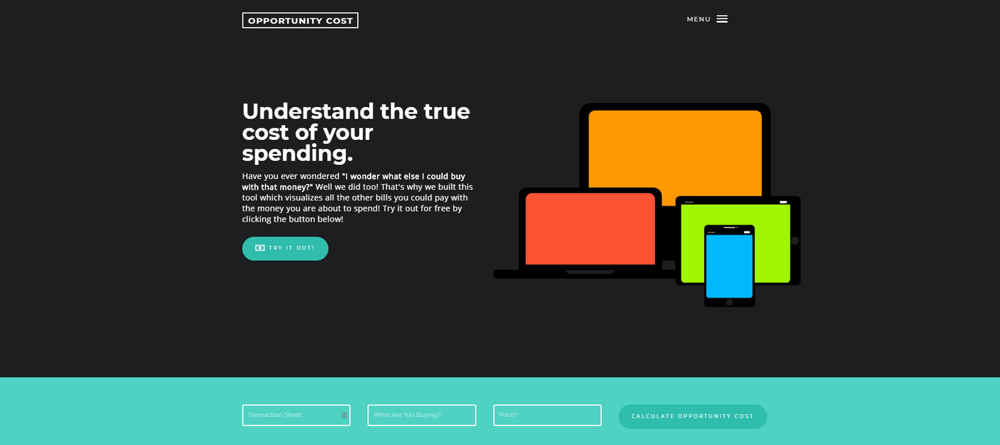
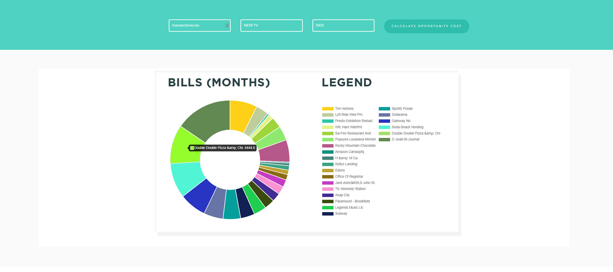

# Opportunity-Cost Visualizer
Feature for mobile banking to visualize the opportunity cost of making big purchases and encourage better saving habits.

## How It Works
Users put in a csv file of their transactions (can be downloaded from any bank web app), what they are considering buying and the related price. Data analysis on the csv file is performed using python (pandas, numpy, flask, diflib) and a custom chart is visualized with JavaScript (Chart.js)/HTML/CSS to illustrate the opportunity cost. Chart displays how many months of customers' bills can be paid with the moeny they are about to spend. 

## Challenges 
Main challenge was connecting the front-end and back-end. This is the first project I've done so to save some time, edited an HTML template from FREEHTML5.co so I could focus more on more pressing matters

## Next Steps / What I Would Add
Wasn't sure of the legal implications behind automating the loging into bank to download csv part. Perhaps add in a user-login system so users can keep track of how many impulsive decisions they'e prevented using the app/money they've saved, etc. 

## SCREENSHOTS

